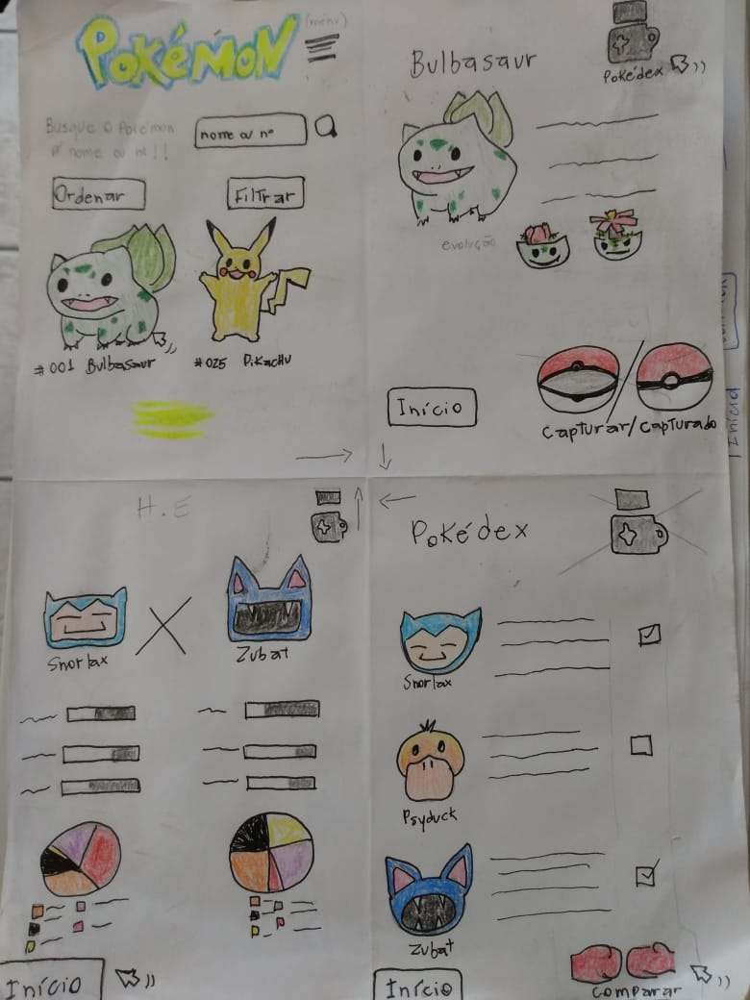

# Data Lovers

## Índice

* Resumo do projeto
* Histórias dos usuários
* Protótipo de baixa fidelidade
* Testes de usabilidade

***

## Resumo do projeto
Esse projeto, em dupla, consistiu em criarmos uma página baseada em um dos bancos de dados disponíveis, no nosso caso escolhemos os banco de dados do Pokemón. A partir disso foi preciso pensar nas necessidades do usário para relacionarmos com a forma de como seria aplicado a manipulação dos dados disponíveis e de como os atributos obrigatórios se desenharia: a visualização dos dados, o filtrar, o ordenar e um cálculo agregado.

## Histórias dos usuários
Nessa parte foi precsio criar personas para entendermos nossos usuários e suas respectivas necessidades. Nossos protótipos de personas foram dois:

-Sophia, 25 anos, que gostaria de ver todos os pokemóns na tela e poder achar por ordem alfabética ou procurar pelo nome.
-caíque, 16 anos, que gostaria de ter a possiblidade de filtrar os pokémons pelo tipo e  saber a porcentagem respectiva.

A partir dessas personas foi feito o protótipo de desenho do produto que poderia resolver as necessidades que os usuários alegaram.

## Protótipo de baixa fidelidade

Aqui os rascunhos de solução foram se modificando ao longo das práticas de funcionalidade.

## Testes de usabilidade
Nos testes de usabilidade a parte do select de "selecionar um tipo" não retorna a mostrar todos os pokemóns na tela ao ser clicado novamente.

